Introduction
============

Seer - a gui frontend to gdb for Linux.   (Ernie Pasveer  epasveer@att.net)

This project is actively worked on. The aim is a simple, yet pleasing gui to gdb.

Please report any bugs or desired features to my email or create a [task](https://github.com/epasveer/seer/issues) in my
GitHub project page.


Installation
============
 
Seer can be installed either from a package manager or from source.
> [!NOTE]
>  Make sure the requirements are met before installing.

Requirements
---------
* Linux
* C++17
* gdb with "mi" interpreter (check by running: `gdb --interpreter=mi`)
* CMake (3.10 or newer)
* QT6
   * When building Seer from source, you will need the QT6 "devel" packages installed on your system for your distribution.
      * Core
      * Gui
      * Widgets
      * PrintSupport
      * Charts
      * Svg
   * Qt6 build instructions are here: https://github.com/epasveer/seer/wiki/Building-Seer---Qt6

* QT5
   * **Seer no longer compiles with Qt5.** The 2.3 source tree is the last one that does.
   * Qt5 build instructions are here: https://github.com/epasveer/seer/wiki/Building-Seer---Qt5

Install from package
---------
Available through the following package managers:

### Pamac (Manjaro)

    pamac install seer

Install from source
---------
(Recommended) Seer can be built with Qt6 by following the instructions below.

https://github.com/epasveer/seer/wiki/Building-Seer---Qt6

It can still be built with Qt5, for the time being by following the instructions below.

https://github.com/epasveer/seer/wiki/Building-Seer---Qt5


NEWS
====

Check out [Seer's Wiki page](https://github.com/epasveer/seer/wiki) on github.

* Version v1.17 will be the last Qt5 release.
* The next release will be v2.0 and will be Qt6 based. However, for the time being, it's still able to be compiled with Qt5.
* If you want the latest stable Qt5 source, grab v1.17 from here: https://github.com/epasveer/seer/releases/tag/v1.17


GUI overview
============

Examples of the various Seer views and dialogs.

Main View
---------

The main view for Seer looks like this:
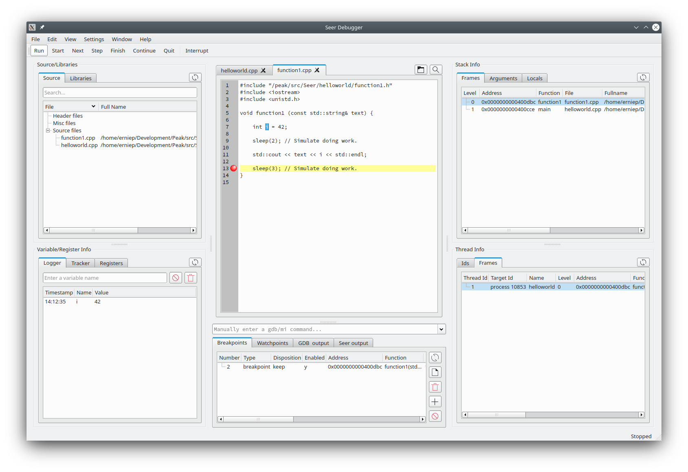

* Source/Function/Types/Variables/Libraries
    * The list of source/header files that were used in the program.
    * Search for Functions, Types, and Static Variables.
      Dobule clicking will open the source file.
    * The list of shared libraries referenced by the program.
    * The list of source/header files can be searched. This will "shrink" the list of files shown.
    * Double clicking on a file will open it in the Code Manager.

* Variable/Register Info
    * Show variable and register values.
    * "Logger" - log the value of a variable. Manually enter it or double click on the variable in the file
      that is opened in the code manager.
    * "Tracker" - create a list of variables to show the value for whenever gdb reaches a stopping point
      (step, next, finish, etc.). When the stopping point is reached, all variables in the list will show
      their potentially new value.
    * "Registers" - show the values of all cpu registers.

* Code Manager.
    * The large area of the middle part of the Seer gui.
    * Source files are opened in this view.
    * Text in a file can be seached for with ^F.
    * Variables can be added to the "Logger" by double clicking the variable name.
      Double click with CTLR key pressed will prepend variable with "*".
      Double click with SHIFT key pressed will prepend variable with "&".
      Double click with CTRL+SHIFT key pressed will prepend variable with "*&".
    * Variables can be added to the "Tracker" by selecting the variable name and RMB and select
      "Add variable to Tracker".
    * Variables can be added to the "Memory Visualizer" by selecting the variable name and RMB and select
      "Add variable to Memory Visualizer".
    * A breakpoint/printpoint can be created by RMB on a specific line.
    * Can execute to a specific line by RMB on a specific line.
    * Tabs in this view can be detached by double-clicking a tab.

* Breakpoints, Watchpoints, Catchpoints, Printpoints, manual gdb commands, and logs.
    * The area below the Code Manager.
    * Manual commands.  Manually enter a gdb or gdbmi command.
      The commands are remembered for the next Seer use.
    * Breakpoint manager. Create and manage breakpoints.
    * Watchpoint manager. Create and manage watchpoints.
      A watchpoint monitors when a variable is accessed (read, write, read/write).
    * Catchpoint manager. Create and manage catchpoints.
      A catchpoint stops execution on a C++ throw/rethrow/catch call.
    * Printpoint manager. Create and manage printpoints.
      A printpoint is like a breakpoint but it allows you to print variables at
      that printpoint. See gdb's 'dprintf' call.
    * GDB output. A log of any output from the gdb program itself.
    * Seer output. A log of any output from the Seer program itself. As diagnostics.
    * Tabs in this view can be detached by double-clicking a tab.

* Stack frame information.
    * Stack frame list. A frame can be double clicked to change the scope (the current function).
    * Stack frame arguments. For each frame, print the arguments passed to each function.
    * Stack locals. For the current function, print the values of the local variables.

* Thread information.
    * Thread ids. A list of all threads. Double click on a thread id to change the scope (the current thread).
    * Thread frames. For each thread, list its stack frames.

* Supports Gdb's Reverse Debugging mode.
    * Turn instruction recording on or off.
    * Set playback direction to forward or reverse.

Open Dialog
-----------

When the open executable dialog is invoked, it looks like this:
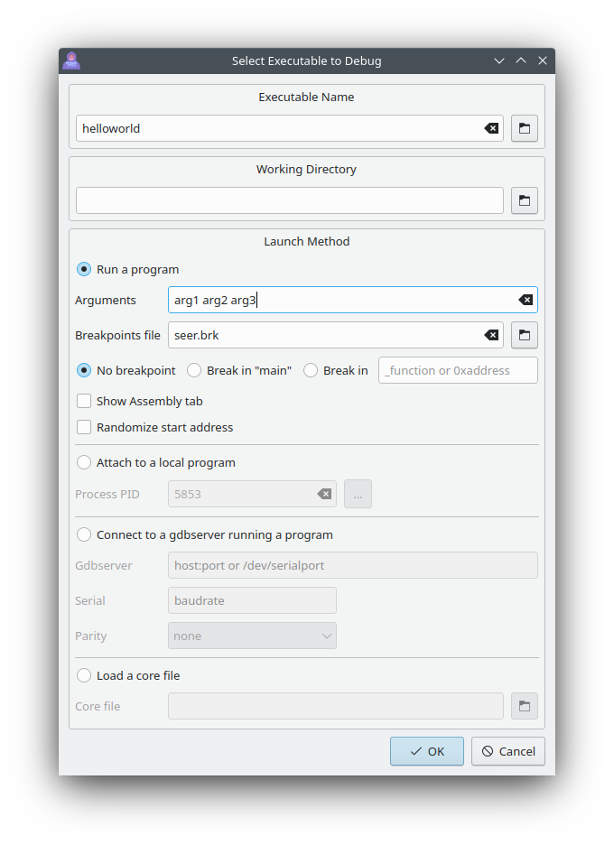

Seer Console
------------

All text output from the executable will go to the Seer console. Text input for the executable can be entered via the console too.
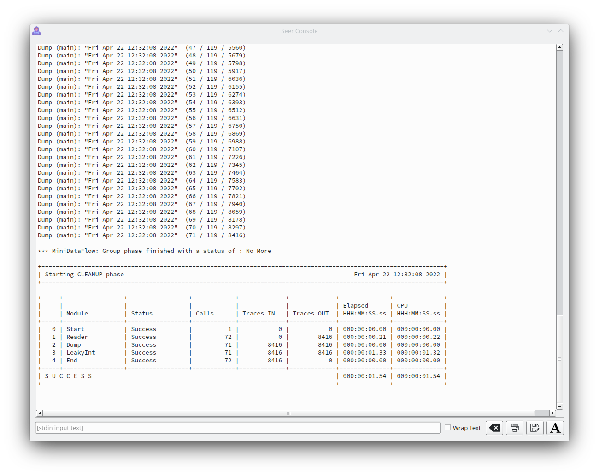


Assembly View
-------------

Normally Seer will just show the source code as tabs in the Code Manager. The program's assembly can also be show as a tab.

Select "View->Assembly View" and an extra tab will be shown alongside the source code tabs that shows the current assembly being executed. Here is an example.
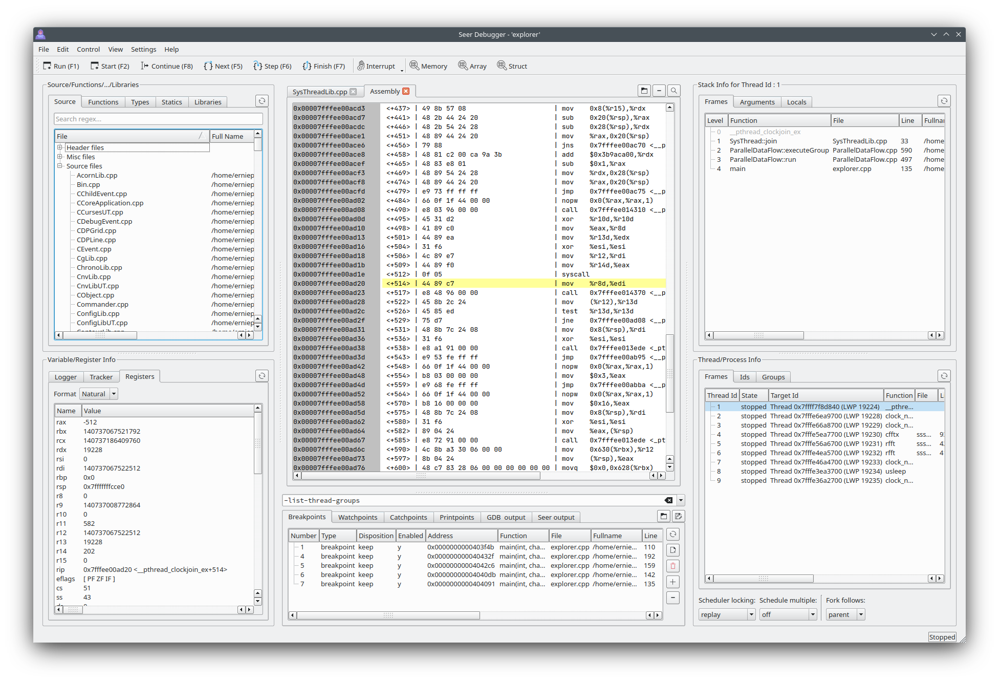

Like the source code tabs, breakpoints can be set in the assembly tab. The current instruction is highlighted.

Double-clicking on entries in the "Breakpoints" tab and the "Stack frames" tab will show the assembly for those addresses.

There are "Nexti" and "Stepi" hot-keys, as defined by your config settings. Normally "Ctrl+F5" and "CTRL+F6".
Using "^F" in the assembly tab will show a powerful search bar.

**The assembly feature in Seer is new. Feel free to suggest changes/features.**


Memory Visualizer
-----------------

When looking at the contents of raw memory in the Memory Visualizer, it looks like this :

Memory | Disassembly
--- | ---
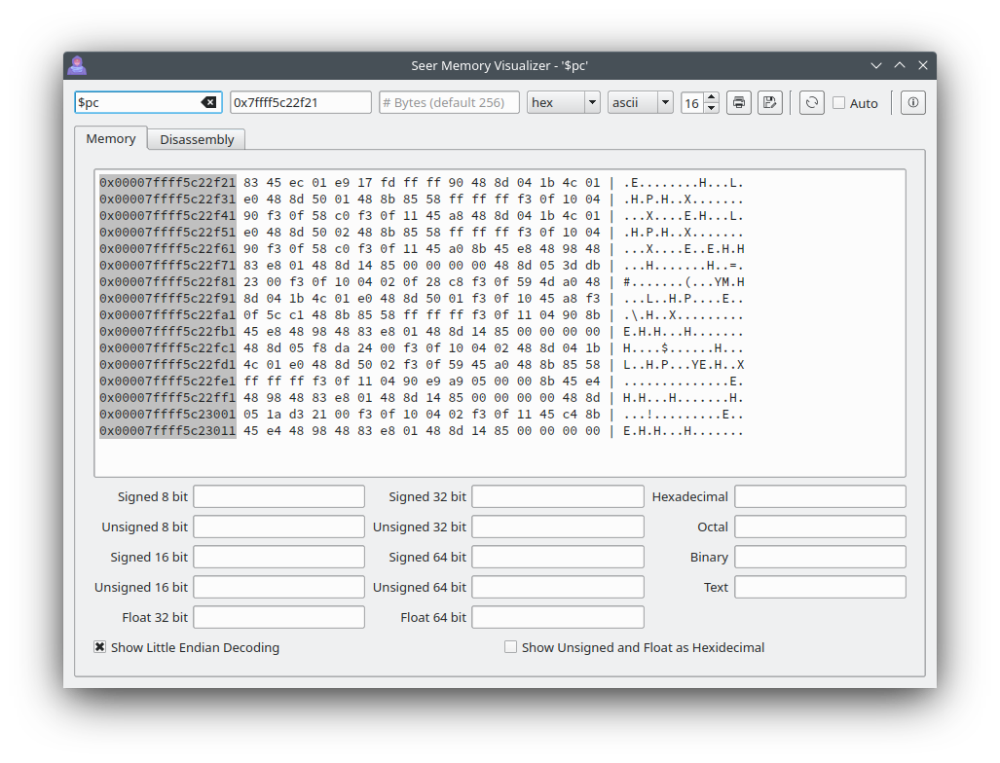 | 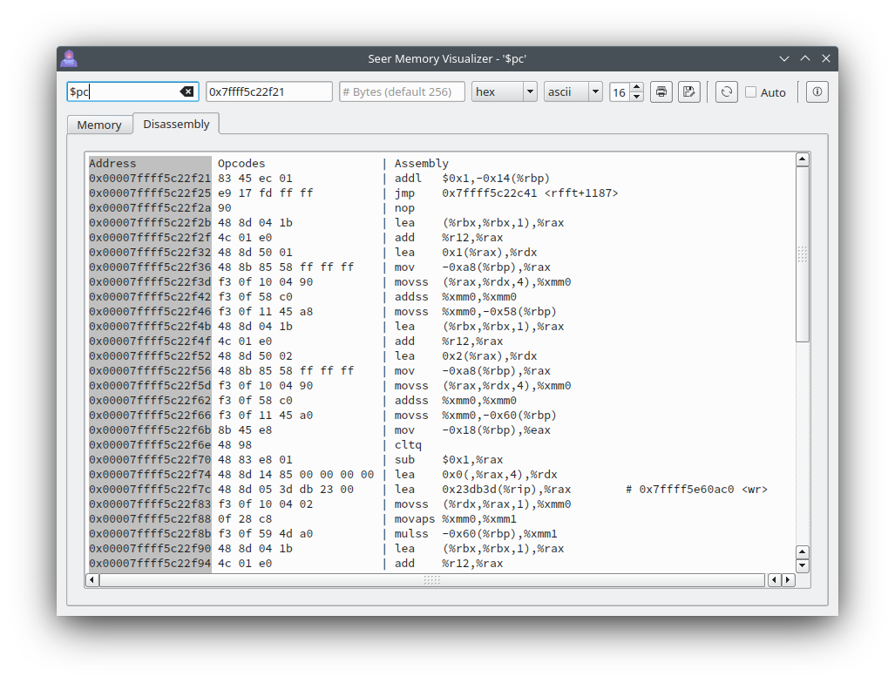

Array Visualizer
-----------------

When looking at the contents of arrays in the Array Visualizer, it looks like this :

Normal | Spline | Scatter
--- | --- | ---
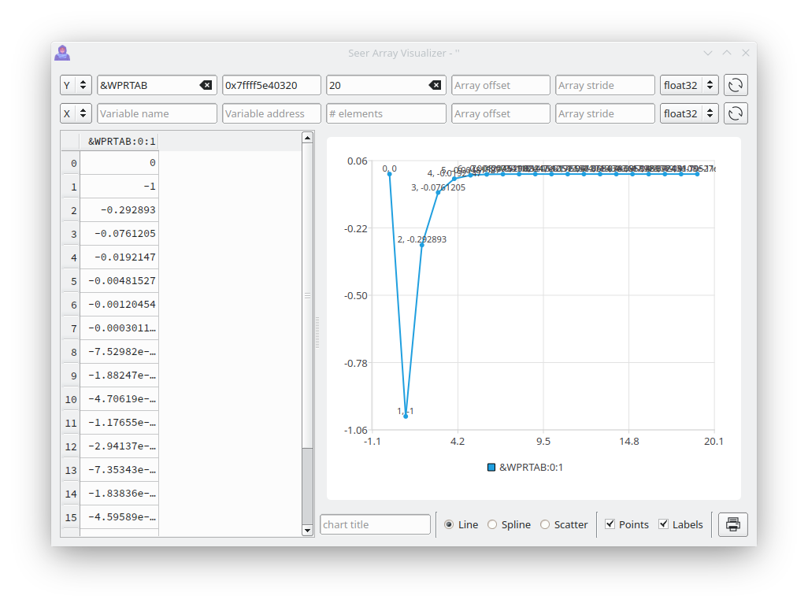 | 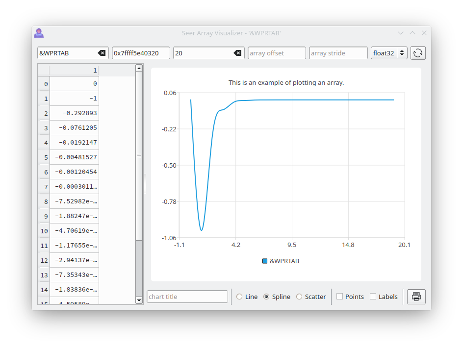 | 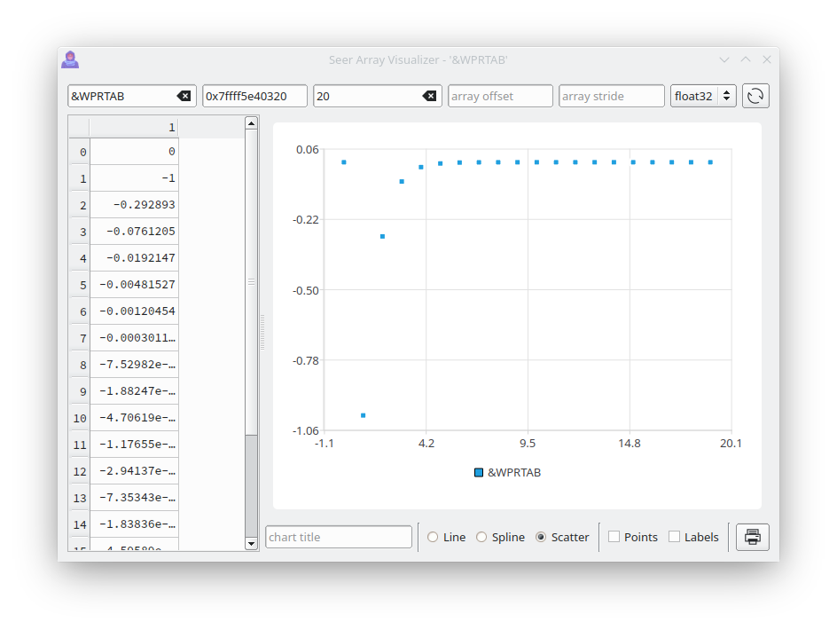

Two arrays can be used as an X-Y plot. For example, this simple 'points' array forms the X-Y outline of a shape.
```
    int main() {
        int points[] = {50,1,20,91,97,35,2,35,79,91,50,1};
        return 0;
    }
```

X values | Y values | XY Values
--- | --- | ---
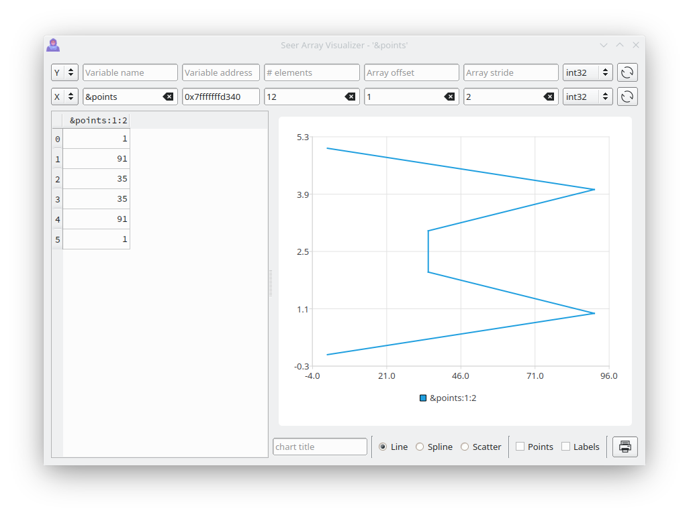 |  | 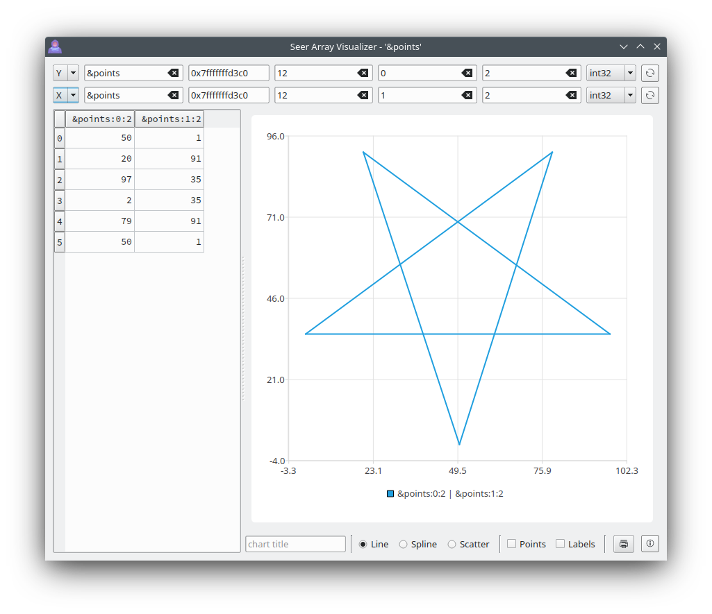

Struct Visualizer
-----------------

When looking at the contents of a C/C++ struct or a C++ class in the Struct Visualizer, it looks like this.
This example shows the contents of "*this" for the current C++ class that Seer is in. All structure members
that are basic types can be edited.

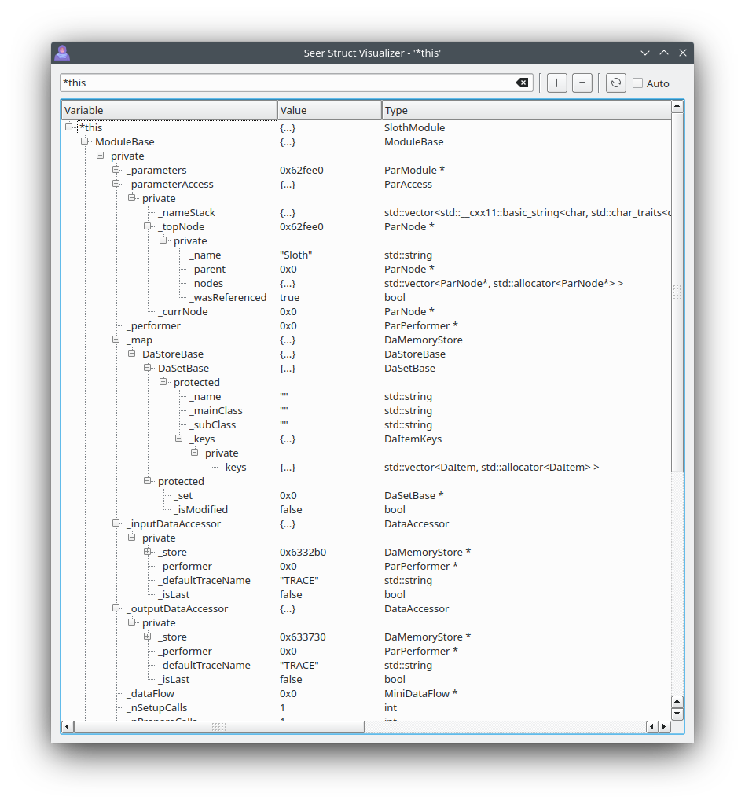

There is also a **Basic Struct Visualizer** that is more light weight, but can not follow pointers and can not
be edited.

Image Visualizer
-----------------

When looking at the contents of raw memory that is an image, the Image Visualizer can be used.

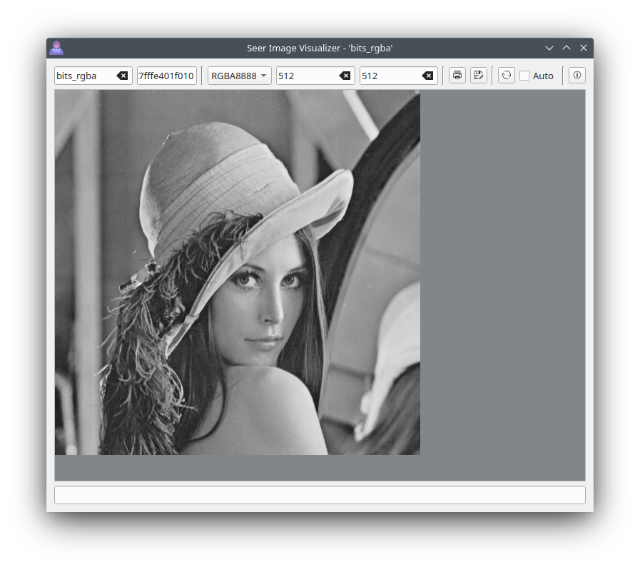

Starting Seer
=============

Seer is meant to easily start the program to debug from the command line. gdb has multiple
methods for debugging a program. So Seer naturally does too.

Go to the Wiki to see all the ways to run Seer.

https://github.com/epasveer/seer/wiki/Starting-Seer

Support/Contact
===============

Send an email to epasveer@att.net for any bugs or features. Or create a [task](https://github.com/epasveer/seer/issues)
in my GitHub project page.

